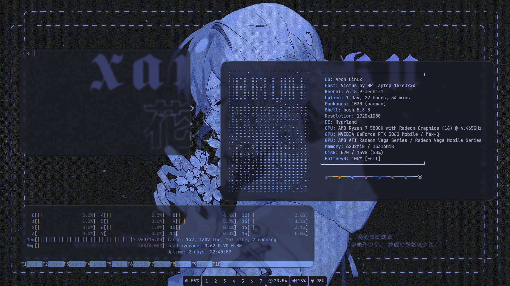
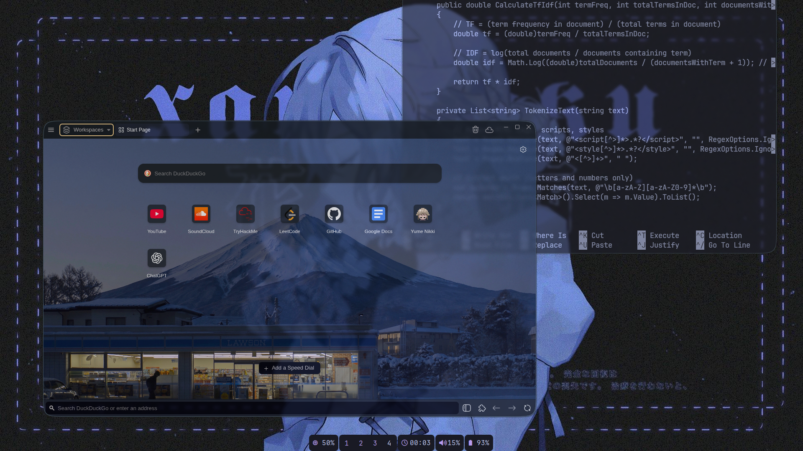
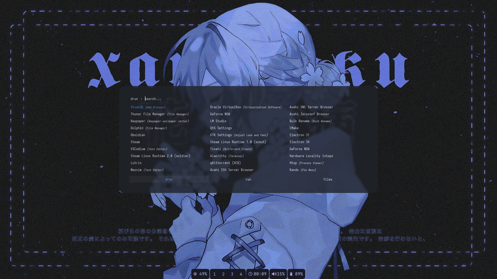

# hypr-rice

# 🌿 Hyprland Dotfiles

This is my personal **Linux rice** — a clean and minimal Hyprland setup designed to keep me focused on my work without unnecessary distractions.  
The goal is simplicity, consistency, and an easy-to-maintain configuration.

---

## 🖥️ System Overview

- **OS**: Arch Linux
- **WM**: Hyprland
- **App Launcher**: Rofi
- **Terminal Emulator**: Kitty
- **File Manager**: *thunar*
- **Wallpaper Manager**: Hyprpaper / Waypaper
- **Task Bar**: Waybar
- **Browser**: Vivaldi
- **Shell**: Bash
- **Wallpaper**: *(Not mine — credit to original creator)*

---

## 📂 Included Configurations
- `hypr/` – Hyprland main configuration 
- `kitty/` – Kitty terminal theme and color palette
- `waybar/` – Task bar styling and modules
- `rofi/` – App launcher theme (credit to Aditya Shakya https://github.com/adi1090x/rofi , mine is launcher type 4 style 8) 
- `.bashrc` – shell style
- `neofetch/` – neofetch configs

---

## 📸 Screenshots

---

## 📜 License
MIT License – feel free to reuse and adapt.

